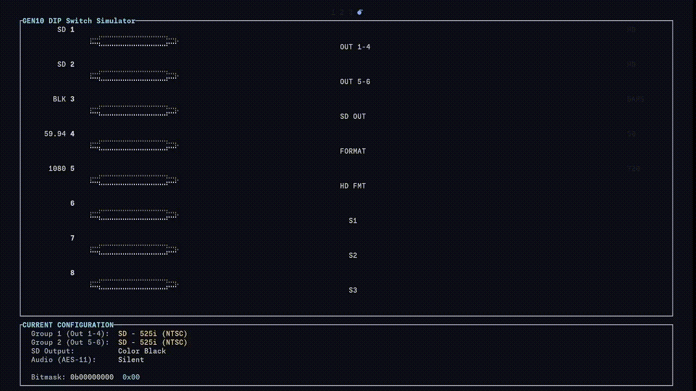

# GEN10 DIP Switch Simulator

A terminal-based interactive simulator for the [AJA Video GEN10](https://www.aja.com/products/gen10) sync generator DIP switch configuration. Built with Rust and [Ratatui](https://ratatui.rs/).

> **Note**: This entire project was vibe-coded by AI from start to finish, including architecture, implementation, testing, and documentation.



## Features

- **Interactive 8-switch DIP bank** with smooth animations
- **Real-time configuration display** showing output formats for both groups
- **Complete Table 2 implementation** supporting all 32 HD format combinations
- **Smooth animations** with circle toggles that slide and change color (gray → green)
- **Color-coded display** for easy identification (HD=Green, SD=Yellow)
- **Bitmask visualization** in both binary and hexadecimal formats
- **60 FPS rendering** for fluid animations

## DIP Switch Configuration

The simulator implements the complete [AJA GEN10](https://www.aja.com/products/gen10) DIP switch specification:

| Switch | Function | LEFT (0) | RIGHT (1) |
|--------|----------|----------|-----------|
| 1 | Sync format for outputs 1-4 | SD | HD |
| 2 | Sync format for outputs 5-6 | SD | HD |
| 3 | SD output and AES signals | Color Black / Silent | 75% Color Bars / Tone |
| 4 | Frame Rate Format | 59.94 (NTSC/525) | 50 (PAL/625) |
| 5 | HD Line Rate Format | 1080 | 720 |
| 6-8 | HD Formats (S1, S2, S3) | Binary configuration for advanced HD formats | |

## Installation

### Prerequisites

- Rust 1.70 or higher
- A terminal with Unicode and color support

### Build from Source

```bash
# Clone the repository
git clone https://github.com/Lomzem/gen10ds.git
cd gen10ds

# Build in release mode
cargo build --release

# Run the application
cargo run --release
```

## Usage

### Key Bindings

| Key | Action |
|-----|--------|
| `1-8` | Toggle corresponding DIP switch |
| `R` | Reset all switches to default (LEFT position) |
| `Q` | Quit application |

### Understanding the Display

The application is divided into three sections:

#### 1. DIP Switches Section
- Shows all 8 switches with visual indicators
- Circle position shows switch state (LEFT or RIGHT)
- Circle color shows state (Gray = LEFT/OFF, Green = RIGHT/ON)
- Labels on left/right show switch options
- Center label shows switch function

#### 2. Current Configuration Section
- **Group 1 (Out 1-4)**: Format for outputs 1-4 (controlled by Switch 1)
- **Group 2 (Out 5-6)**: Format for outputs 5-6 (controlled by Switch 2)
- **SD Output**: Color Black or 75% Color Bars (Switch 3)
- **Audio (AES-11)**: Silent or Tone (Switch 3)
- **Video Format Bitmask**: 8-bit representation of switches 4-8 (video format related switches only). Bits 0-2 are masked out as they control sync and SD output, not video format.

#### 3. Keybindings Section
- Quick reference for available controls

## Format Calculation Logic

### SD Mode
When a group's sync switch (1 or 2) is in LEFT position:
- Shows SD format: `SD - 525i (NTSC)` or `SD - 625i (PAL)`
- HD format switches (5-8) are ignored for that group

### HD Mode
When a group's sync switch (1 or 2) is in RIGHT position:
- Calculates HD format from switches 4-8 using Table 2
- Supports all standard HD formats:
  - 1080i/p at various frame rates
  - 720p at various frame rates
  - PSF (Progressive Segmented Frame) formats

### Examples

**Default Configuration** (All switches LEFT):
```
Group 1: SD - 525i (NTSC)
Group 2: SD - 525i (NTSC)
SD Output: Color Black
Audio: Silent
Video Format Bitmask: 0b00000000 (0x00)
```

**Mixed HD/SD** (Switches 1=RIGHT, 3=RIGHT):
```
Group 1: HD - 1080i59.94 (1080psf29.97)
Group 2: SD - 525i (NTSC)
SD Output: 75% Color Bars
Audio: Tone
Video Format Bitmask: 0b00000000 (0x00)
```

**Full HD 720p50** (Switches 1=RIGHT, 2=RIGHT, 4=RIGHT, 5=RIGHT):
```
Group 1: HD - 720p50
Group 2: HD - 720p50
SD Output: Color Black
Audio: Silent
Video Format Bitmask: 0b00011000 (0x18)
```

## Technical Details

### Architecture

The project is organized into five main modules:

- **main.rs**: Application entry point and terminal setup
- **app.rs**: Application state management and animation system
- **dipswitch.rs**: DIP switch data model and configuration logic
- **format_calculator.rs**: HD/SD format calculation (Table 2 implementation)
- **ui.rs**: Canvas-based rendering with Ratatui

### Animation System

- **Frame rate**: 60 FPS for smooth animations
- **Animation duration**: 150ms per switch toggle
- **Color interpolation**: Linear gradient from gray (128,128,128) to green (0,255,0)
- **Rendering**: Canvas widget with Braille markers for high resolution

### Dependencies

- [ratatui](https://crates.io/crates/ratatui) 0.29 - Terminal UI framework
- [crossterm](https://crates.io/crates/crossterm) 0.28 - Cross-platform terminal manipulation

## Development

### Running Tests

```bash
cargo test
```

All core functionality is covered by unit tests:
- DIP switch state management
- Bitmask calculation
- Format calculation (all 32 Table 2 combinations)
- SD/HD mode switching

### Project Structure

```
gen10ds/
├── Cargo.toml              # Project dependencies
├── README.md               # This file
├── DIPSWITCHES.md          # GEN10 hardware reference
├── IMPLEMENTATION_PLAN.md  # Detailed implementation plan
├── .gitignore
└── src/
    ├── main.rs             # Entry point
    ├── app.rs              # App state and animations
    ├── dipswitch.rs        # DIP switch model
    ├── format_calculator.rs # Format calculation
    └── ui.rs               # UI rendering
```

## References

- [GEN10 DIP Switch Settings](DIPSWITCHES.md) - Complete hardware documentation
- [Implementation Plan](IMPLEMENTATION_PLAN.md) - Detailed technical specifications
- [Ratatui Documentation](https://ratatui.rs/) - TUI framework docs

## License

MIT License - See [LICENSE](LICENSE) for details.

## Contributing

Contributions are welcome! Please feel free to submit a Pull Request.

## Acknowledgments

- Built with [Ratatui](https://ratatui.rs/)
- For the [AJA Sync GEN10](https://www.aja.com/products/gen10) video generator
- Canvas rendering techniques from the Ratatui examples
- **Completely vibe-coded by AI** - From initial planning through final implementation

---

**Note**: This is a simulator for educational and configuration planning purposes. It does not connect to actual GEN10 hardware.
